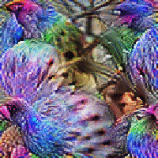

# Feature Visualization by Sampling
Visualizing features in artificial neural networks by sampling from probability distribution of images that highly activate neurons. 

## Dependencies

1. TensorFlow [https://www.tensorflow.org]
2. Lucid (for feature visualization) [https://github.com/tensorflow/lucid]
3. TensorFlow Probability (for HMC) [https://www.tensorflow.org/probability/]

## Motivation
Feature Visualization is a powerful tool to interpret what each neuron in a deep neural network is learning. Olah, et al. [1] use optimization to compute the image that maximally activates a given neuron in the network. Along with clever tricks, optimization-based approaches to visualization can produce beautiful and interpretable image representations of neurons. Some examples are as follows:

<p align="center">


</p>
<p align="center">
Optimized images for (a) Mixed 3c layer (b) Mixed 4d central neuron (c) Mixed 5b layer (d) Mixed 5c central neuron (all channel 0), Inception-V1-slim model.
</p>

However, a single image might not be sufficient to represent a neuron. For example, a neuron might seem to detect dogs, based on the visualization of the single image that maximally activates that neuron. But the same neuron could participate in detecting other semantic categories. It may be highly activated (albeit not as much) by cats, or even, unrelated objects, like maybe certain parts of cars. It is hard to understand what a neuron is detecting without visualizing a whole range of high-activation images. Olah et al. [1] discuss ways obtain diverse visualizations by adding a 'diversity term' to the optimization objective. A shortcoming of this approach is that it can create undue bias towards diversity, and introduce unrelated artifacts.

The idea here is to define a distribution over the space of all images, where the probability density of an image is proportional to the activation it produces in the neuron of interest. If we sample from this image distribution, we can visualize multiple, diverse images (if they exist) that contribute to high activations.

MCMC methods can be used to sample from such unnormalized probability distributions. In cases where the density function is differentiable with respect to inputs, one can use gradient-based MCMC methods like Hamiltonian Monte Carlo (HMC) [2]. HMC uses gradients to make more informed proposals and traverse the state space more efficiently, leading to faster convergence.

## Usage
The usage is fairly straightforward.

```python
import lucid.modelzoo.vision_models as models
import lucid.optvis.objectives as objectives
import samplevis

# Import a model from Lucid's modelzoo.
model = models.InceptionV1_slim()
model.load_graphdef()

# Specify activation objective - either neuron/channel/layer (from lucid.optvis.objectives).
# In this case, it is the activation of the central neuron in layer Mixed-5b, channel 0.
obj = objectives.neuron("InceptionV1/InceptionV1/Mixed_5b/concat", 0)

# Run sampling on the specified model and objective.
samples = samplevis.render(model, obj, hmc_opts=dict(num_results=10))
```

You can specify HMC hyperparameters in `hmc_opts`. List of HMC parameters:
1. `num_results`: Number of samples required.
2. `step_size`: Step size of HMC's leapfrog integrator.
3. `num_leapfrog_steps`: Number of steps to run the leapfrog integrator for.
4. `num_burnin_steps`: Number of steps to take before starting to collect results.
5. `num_steps_between_results`: Number of steps between collecting consecutive results.

## Implementation Notes

1. `hmc.py`: Has functions imported from TensorFlow Probability that perform MCMC sampling using the HMC kernel. The TF-Probability's HMC API essentially requires a function that constructs a TensorFlow graph, mapping the input (image) to the unnormalized log-probability of the image. It uses this function to compute log-probability and gradients of the log-probability required for HMC sampling.

2. `samplevis.py`: Imports functions from Lucid that (a) constructs a TensorFlow graph mapping the input image to activation of neurons/channels/layers of a pre-trained network; this function is passed to TF-Probability, (b) has optimization routines for feature visualization that is used to obtain the initial state for HMC Markov chain sampling.

## Results
The results are not good. HMC produces samples that essentially look like random noise. This is true even when the HMC chain is initialized from a good image obtained by Lucid's optimization.

<p align="center">




</p>
<p align="center">
HMC samples obtained for various neurons/layers. Each chain has been initialized from an optimized image. Then, 10 images are sampled with 100 HMC steps between every pair of consecutive samples. The samples become progressively worse. (a) Mixed 3c layer (b) Mixed 4d central neuron (c) Mixed 5b layer (d) Mixed 5c central neuron (all channel 0), Inception-V1-slim model.
</p>

My hypotheses for why the results are bad:

* The state space is still too large, even for HMC.
* The state space is densely covered by *adversarial examples*. These are images that look like random noise, but produce high activations.


## References

[1]: Olah, et al., "Feature Visualization", Distill, 2017. [https://distill.pub/2017/feature-visualization/]

[2]: Neal, Radford, "MCMC using Hamiltonian dynamics", Handbook of Markov Chain Monte Carlo, 2011. [https://arxiv.org/pdf/1206.1901.pdf]